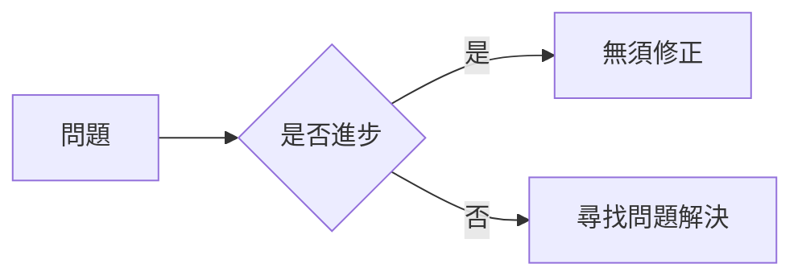
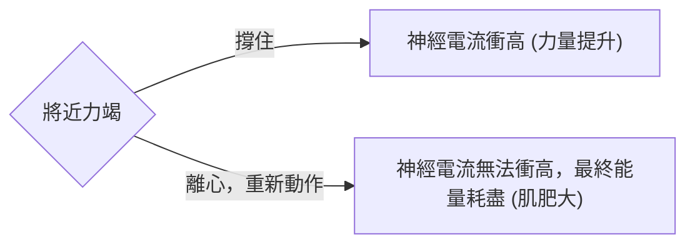

## 上週問題
### 體感左右差異

```mermaid 
graph LR 
A[問題] --> B{是否進步}
B -->|是| C[無須修正]
B -->|否| D[尋找問題解決]
```
- 左右前鉅肌發力不平均
	- 後側緊繃導致前側無法正確收縮
	- 左(正常)側感受同樣錯誤姿勢的發力位置，放鬆右(問題)側相應位置
### 動作問題
- 伏地挺身 : 想像胸口下有滾筒，額頭向下碰地，身體不碰滾筒
- 高腳杯 : 核心撐不住就停

## 本週

```mermaid
graph LR
A{將近力竭} -->|撐住| C["神經電流衝高 (力量提升)"]
A -->|離心，重新動作| D["神經電流無法衝高，最終能量耗盡 (肌肥大)"]
```
### 水平坐姿划船
- 起始位置使用腿取代腰椎拉開距離，放回時同理